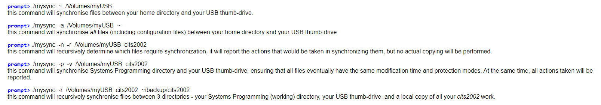

# File Synchronization Utility

## Overview
mysync is a command-line utility developed in C11 for synchronizing the contents of two or more directories. 

## Background

In our digital lives, we often work across multiple computers and portable storage devices. Cloud services are not always accessible, so we rely on USB thumb-drives to transfer files. However, keeping track of the latest versions can be challenging. Our goal is to synchronize files between computers and USB drives, ensuring all locations have the most up-to-date copies. This process, known as file synchronization or syncing, simplifies managing files across different devices.

## Program invocation
The program will be invoked from the command-line with zero-or-more options (switches) and two-or-more directory names:

## File patterns
Globbing, or wildcard expansion, is a Unix-like operating system feature allowing concise specification of multiple files and directories using special characters like *, ?, [ ], and { }. These characters are widely supported and, in Unix systems, expanded by the shell before passing them to a new child process. In our programs, like mysync with options -i and -o, where we perform globbing ourselves, we can convert a glob-pattern to a regular expression using the glob2regex function. Note that for proper execution, file patterns must be enclosed in single quotes, such as:

## Example

