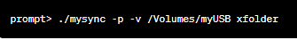

# File Synchronization Utility

## Overview
mysync is a command-line utility developed in C11 for synchronizing the contents of two or more directories. 

## Background

In our digital lives, we often work across multiple computers and portable storage devices. Cloud services are not always accessible, so we rely on USB thumb-drives to transfer files. However, keeping track of the latest versions can be challenging. Our goal is to synchronize files between computers and USB drives, ensuring all locations have the most up-to-date copies. This process, known as file synchronization or syncing, simplifies managing files across different devices.

## Program invocation
The program will be invoked from the command-line with zero-or-more options (switches) and two-or-more directory names:

prompt> ./mysync  [options]  directory1  directory2  [directory3  ...]

The program's options are:

-a	By default, 'hidden' and configuration files (those beginning with a '.' character) are not synchronised because they do not change very frequently. The -a option requests that all files, regardless of whether they begin with a '.' or not, should be considered for synchronisation.

-i pattern	Filenames matching the indicated pattern should be ignored; all other (non-matching) filenames should be considered for synchronisation. The -i option may be provided multiple times.

-n	By default, mysync determines what files need to be synchronised and then silently performs the necessary copying. The -n option requests that any files to be copied are identified, but they are not actually synchronised. Setting the -n option also sets the -v option.

-o pattern	Only filenames matching the indicated pattern should be considered for synchronisation; all other (non-matching) filenames should be ignored. The -o option may be provided multiple times.

-p	By default, after a file is copied from one directory to another, the new file will have the current modification time and default file permissions. The -p option requests that the new copy of the file have the same modification time and the same file permissions as the old file.

-r	By default, only files found immediately within the named directories are synchronised. The -r option requests that any directories found within the named directories are recursively processed.

-v	By default, mysync performs its actions silently. No output appears on the stdout stream, although some errors may be reported on the stderr stream. The -v option requests that mysync be more verbose in its output, reporting its actions to stdout. g .

## File patterns
Globbing, or wildcard expansion, is a Unix-like operating system feature allowing concise specification of multiple files and directories using special characters like *, ?, [ ], and { }. These characters are widely supported and, in Unix systems, expanded by the shell before passing them to a new child process. In our programs, like mysync with options -i and -o, where we perform globbing ourselves, we can convert a glob-pattern to a regular expression using the glob2regex function. Note that for proper execution, file patterns must be enclosed in single quotes, such as:

prompt> ./mysync  -o  '*.[ch]'  ....

## Example

this command will synchronise files between home directory and USB thumb-drive.

this command will synchronise all files (including configuration files) between  home directory and  USB thumb-drive.

this command will recursively determine which files require synchronization, it will report the actions that would be taken in synchronizing them, but no actual copying will be performed.

 

this command will synchronise xfolder directory and  USB thumb-drive, ensuring that all files eventually have the same modification time and protection modes. At the same time, all actions taken will be reported.

this command will recursively synchronise files between 3 directories - xfolder  directory, USB thumb-drive, and a local copy of all xfolder work.
